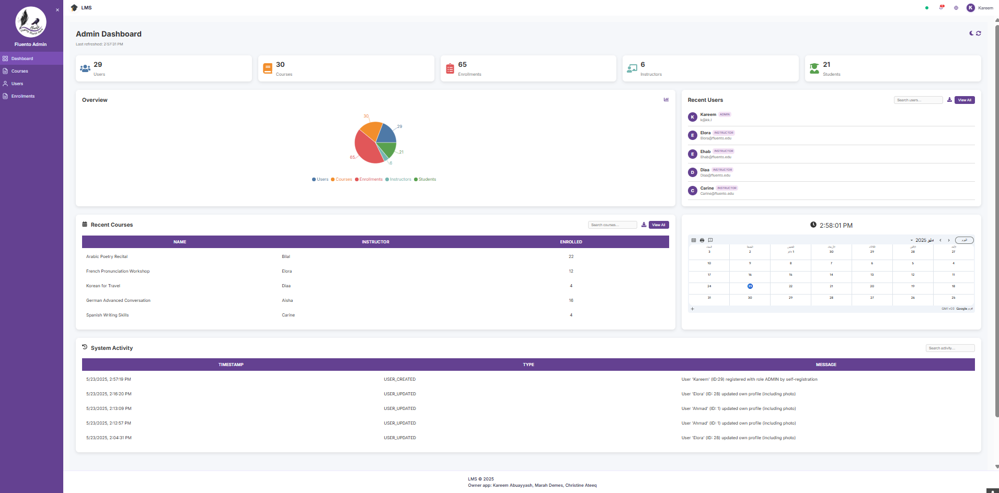
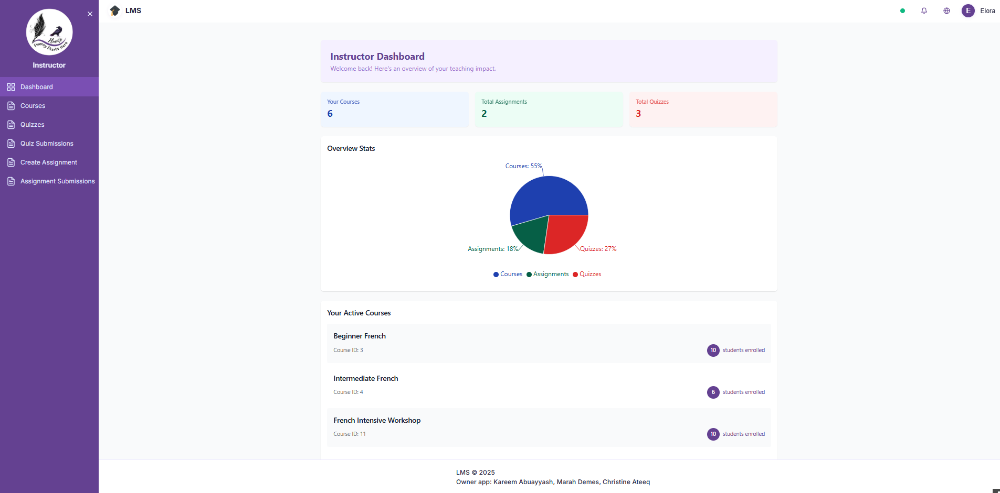
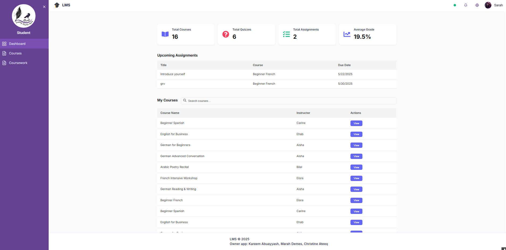

# Fluento Learning Management System (Frontend)

A modern, responsive Learning Management System frontend built with React. This application provides different interfaces for Administrators, Instructors, and Students to manage courses, assignments, quizzes, and more.

## 🚀 Features

### For Administrators
- 📊 Dashboard with analytics and system overview
- 👥 User management (create, edit, delete users)
- 📚 Course management and oversight
- 📝 Enrollment management
- ⚙️ System-wide settings and configuration



### For Instructors
- 🎓 Course creation and management
- 📋 Assignment creation and grading
- 🧪 Quiz creation and management
- 📖 Course content management
- 📈 Student progress tracking and analytics



### Quiz Management
  Create and manage quizzes with flexible question types and navigation modes:


### Assignment Management
  Create assignments and grade student submissions:


## Quiz Submissions Review
  Review and analyze student quiz performance:


### For Students
- 🏠 Dashboard with enrolled courses and upcoming assignments
- 📚 Course enrollment and browsing
- 📝 Assignment submission and tracking
- 🧪 Quiz taking and results
- 📊 Progress tracking and achievements



### Interactive Quiz Taking
  Take quizzes with various question types and immediate feedback:

  

  


## 🛠️ Tech Stack

- **Frontend Framework**: React 18
- **Build Tool**: Vite
- **Styling**: 
  - Tailwind CSS
  - Bootstrap
  - Custom CSS
- **Routing**: React Router DOM
- **State Management**: React Hooks & Context API
- **HTTP Client**: Axios
- **Icons**: React Icons
- **Charts & Analytics**: Recharts
- **Development**: ESLint, Prettier

## 📋 Prerequisites

Before you begin, ensure you have the following installed:
- Node.js (v16.0.0 or higher)
- npm (v8.0.0 or higher) or yarn (v1.22.0 or higher)
- Git

## 🔧 Installation

### 1. Clone the Repository
```bash
git clone https://github.com/swer354/Frontend-LMS.git
cd Frontend-LMS
```

### 2. Install Dependencies
```bash
npm install
# or if you prefer yarn
yarn install
```

### 3. Environment Configuration
Create a `.env` file in the root directory:
```env
VITE_API_BASE_URL=http://localhost:8080/api
VITE_APP_NAME=Fluento LMS
VITE_GOOGLE_CLIENT_ID=your_google_client_id_here
```

### 4. Start Development Server
```bash
npm run dev
# or
yarn dev
```

The application will be available at `http://localhost:5173`

## 🏗️ Building for Production

```bash
# Build the project
npm run build
# or
yarn build

# Preview the production build
npm run preview
# or
yarn preview
```

The build artifacts will be stored in the `dist/` directory.

## 📁 Project Structure

```
Frontend-LMS/
├── public/
│   ├── favicon.ico
│   └── index.html
📦src
 ┣ 📂api
 ┃ ┗ 📜axios.js
 ┣ 📂assets
 ┃ ┣ 📜log.png
 ┃ ┣ 📜logo.png
 ┃ ┗ 📜react.svg
 ┣ 📂components
 ┃ ┣ 📂Auth
 ┃ ┃ ┣ 📜ForgotPassword.jsx
 ┃ ┃ ┣ 📜ForgotPassword.module.css
 ┃ ┃ ┣ 📜Login.jsx
 ┃ ┃ ┣ 📜Login.module.css
 ┃ ┃ ┣ 📜LoginSuccess.jsx
 ┃ ┃ ┣ 📜ResetPassword.jsx
 ┃ ┃ ┗ 📜ResetPassword.module.css
 ┃ ┣ 📂Layout
 ┃ ┃ ┣ 📜Layout.css
 ┃ ┃ ┗ 📜Layout.jsx
 ┃ ┣ 📂ProfileSettings
 ┃ ┃ ┣ 📜ProfilePicture.jsx
 ┃ ┃ ┣ 📜ProfileSettings.jsx
 ┃ ┃ ┗ 📜ProfileSettings.module.css
 ┃ ┣ 📂Toast
 ┃ ┃ ┣ 📜toast.css
 ┃ ┃ ┗ 📜ToastProvider.jsx
 ┃ ┣ 📜ErrorBoundary.jsx
 ┃ ┗ 📜ProtectedRoute.jsx
 ┣ 📂pages
 ┃ ┣ 📂admin
 ┃ ┃ ┣ 📜AdminDashboard.jsx
 ┃ ┃ ┣ 📜AdminDashboard.module.css
 ┃ ┃ ┣ 📜AdminProfileSettings.jsx
 ┃ ┃ ┣ 📜Courses.jsx
 ┃ ┃ ┣ 📜Courses.module.css
 ┃ ┃ ┣ 📜Enrollments.css
 ┃ ┃ ┣ 📜Enrollments.jsx
 ┃ ┃ ┣ 📜Users.css
 ┃ ┃ ┗ 📜Users.jsx
 ┃ ┣ 📂instructor
 ┃ ┃ ┣ 📜AssignmentSubmissions.jsx
 ┃ ┃ ┣ 📜Courses.css
 ┃ ┃ ┣ 📜Courses.jsx
 ┃ ┃ ┣ 📜CreateOrEditAssignment.jsx
 ┃ ┃ ┣ 📜Dashboard.jsx
 ┃ ┃ ┣ 📜InstructorAssignments.css
 ┃ ┃ ┣ 📜InstructorCourseContent.css
 ┃ ┃ ┣ 📜InstructorCourseContent.jsx
 ┃ ┃ ┣ 📜InstructorProfileSettings.jsx
 ┃ ┃ ┣ 📜QuizSubmissions.css
 ┃ ┃ ┣ 📜QuizSubmissions.jsx
 ┃ ┃ ┣ 📜Quizzes.css
 ┃ ┃ ┗ 📜Quizzes.jsx
 ┃ ┗ 📂StudentDashboard
 ┃ ┃ ┣ 📜Coursework.css
 ┃ ┃ ┣ 📜Coursework.jsx
 ┃ ┃ ┣ 📜QuizAttempt.css
 ┃ ┃ ┣ 📜QuizAttempt.jsx
 ┃ ┃ ┣ 📜StudentAssignmentDetail.css
 ┃ ┃ ┣ 📜StudentAssignmentDetails.jsx
 ┃ ┃ ┣ 📜StudentCourseDetails.css
 ┃ ┃ ┣ 📜StudentCourseDetails.jsx
 ┃ ┃ ┣ 📜StudentCourses.css
 ┃ ┃ ┣ 📜StudentCourses.jsx
 ┃ ┃ ┣ 📜StudentDashboard.css
 ┃ ┃ ┣ 📜StudentDashboard.jsx
 ┃ ┃ ┗ 📜StudentProfileSettings.jsx
 ┣ 📂Sidebar
 ┃ ┣ 📜AdminSidebar.jsx
 ┃ ┣ 📜InstructorSidebar.jsx
 ┃ ┗ 📜StudentSidebar.jsx
 ┣ 📂utils
 ┃ ┣ 📜auth.ts
 ┃ ┗ 📜toast.ts
 ┣ 📜App.css
 ┣ 📜App.jsx
 ┣ 📜index.css
 ┗ 📜main.jsx
```

## 🔐 Authentication & Authorization

The system supports multiple authentication methods:


### Login Methods
- **Username/Password**: Traditional login with email and password
- **Google OAuth**: Single sign-on with Google accounts
- **Password Reset**: Email-based password recovery

### User Roles
- **Admin**: Full system access and user management
- **Instructor**: Course and content management capabilities
- **Student**: Course enrollment and participation features

Each role has dedicated routes, components, and permissions managed through the `ProtectedRoute` component.

## 🌐 API Integration

The frontend communicates with a Spring Boot backend API. Key features:

- **Axios Interceptors**: Automatic token management and error handling
- **Request/Response Logging**: Development debugging support
- **Error Handling**: Centralized error management with user-friendly messages
- **Authentication**: JWT token-based authentication

### API Configuration
```javascript
// src/api/axios.js
import axios from 'axios';

const API = axios.create({
  baseURL: import.meta.env.VITE_API_BASE_URL,
  timeout: 10000,
});

// Request interceptor for auth tokens
API.interceptors.request.use((config) => {
  const token = localStorage.getItem('token');
  if (token) {
    config.headers.Authorization = `Bearer \${token}`;
  }
  return config;
});
```

## 🎨 Styling & Theming

- **Tailwind CSS**: Utility-first CSS framework
- **Bootstrap**: Component-based CSS framework
- **Custom CSS**: Additional styling and overrides
- **Responsive Design**: Mobile-first approach
- **CSS Variables**: Consistent theming and easy customization

### Color Scheme
```css
:root {
  --primary-color: #007bff;
  --secondary-color: #6c757d;
  --success-color: #28a745;
  --danger-color: #dc3545;
  --warning-color: #ffc107;
  --info-color: #17a2b8;
}
```

## 📄 License

This project is licensed under the MIT License - see the [LICENSE](LICENSE) file for details.

## 👥 Contributors

- **Marah Demes** - Frontend Developer
- **Kareem Abuayyash** - Full Stack Developer  
- **Christine Ateeq** - UI/UX Designer & Frontend Developer
**Made with ❤️ by the Fluento Team**
